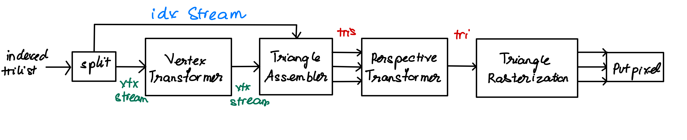

# Graphics Pipeline C++
Status: ongoing

Repo where I learn 3D programming fundamentals and implement graphics pipeline. 

# Grahics Pipeline

src: youtube.com/watch?v=aeU8eVAExMQ&list=PLqCJpWy5Fohe8ucwhksiv9hTF5sfid8lA&index=9 

# Testing
I test the graphics pipeline on CS430 homeworks
- Test 1: Draw clipped lines 
- Test 2: Sutherland-Hodgman polygon clipping 
- Test 3: Draw clipped, filled polygons  
- Test 4: Draw 3D lines  
- Test 5: Z-buffer rendering  
- Test 6: Bezier curve drawing  
