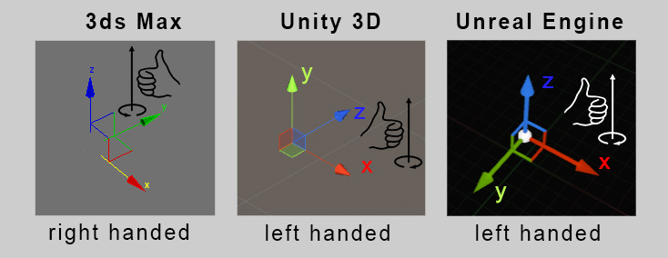
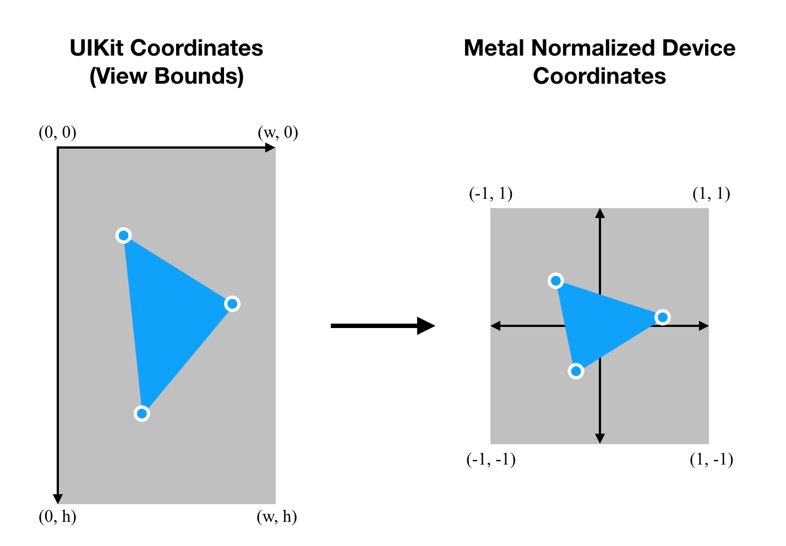

# Graphics Pipeline C++
Status: ongoing

Repo where I learn 3D programming fundamentals and implement graphics pipeline. 

# Overview
**Coordinate System:** Left-handed

src: [here](http://www.aclockworkberry.com/basis-orientations-in-3ds-max-unity-3d-and-unreal-engine)

**Normalized Device Coordinates (NDC)** just like OpenGL

src: [here](http://www.aclockworkberry.com/basis-orientations-in-3ds-max-unity-3d-and-unreal-engine)

# Grahics Pipeline

src: [here](https://stackoverflow.com/questions/58293221/convert-screen-coordinates-to-metals-normalized-device-coordinates) 

# Testing & Result
I test the graphics pipeline on CS430 homeworks
- [Test 1](test/test1): Draw clipped lines 
- [Test 2](test/test2): Sutherland-Hodgman polygon clipping 
- [Test 3](test/test3): Draw clipped, filled polygons  
- [Test 4](test/test4): Draw 3D lines  
- [Test 5](test/test5): Z-buffer rendering  
- [Test 6](test/test6): Bezier curve drawing  

# Tutorials List
- [3D Programming Fundamentals](https://www.youtube.com/playlist?list=PLqCJpWy5Fohe8ucwhksiv9hTF5sfid8lA)
- [Code-It-Yourself! 3D Graphics Engine Part #1 - Triangles & Projection](https://www.youtube.com/watch?v=ih20l3pJoeU&list=PLrOv9FMX8xJE8NgepZR1etrsU63fDDGxO&index=22)
- [Code-It-Yourself! 3D Graphics Engine Part#2 - Normals, Culling, Lighting & Object Files](https://www.youtube.com/watch?v=XgMWc6LumG4&list=PLrOv9FMX8xJE8NgepZR1etrsU63fDDGxO&index=23)
- [Code-It-Yourself! 3D Graphics Engine Part #3 - Cameras & Clipping](https://www.youtube.com/watch?v=HXSuNxpCzdM&list=PLrOv9FMX8xJE8NgepZR1etrsU63fDDGxO&index=24)
- [Code-It-Yourself! 3D Graphics Engine Part #4 - Texturing & Depth Buffers](https://www.youtube.com/watch?v=nBzCS-Y0FcY&list=PLrOv9FMX8xJE8NgepZR1etrsU63fDDGxO&index=25)